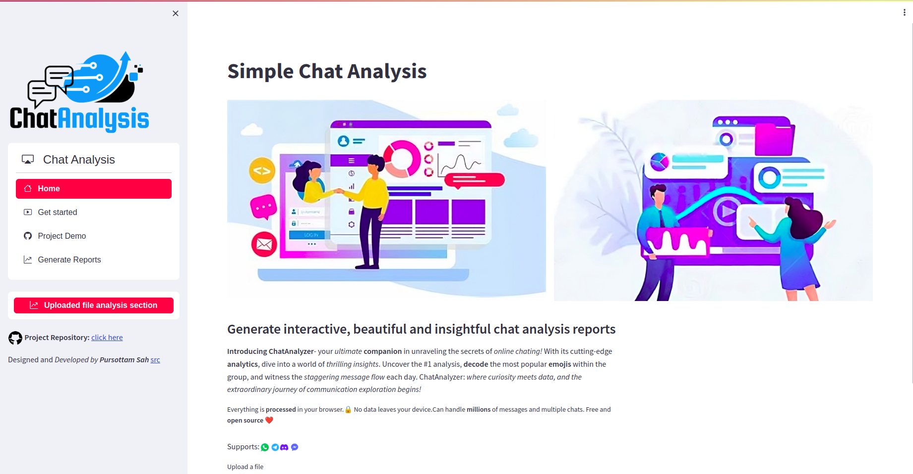
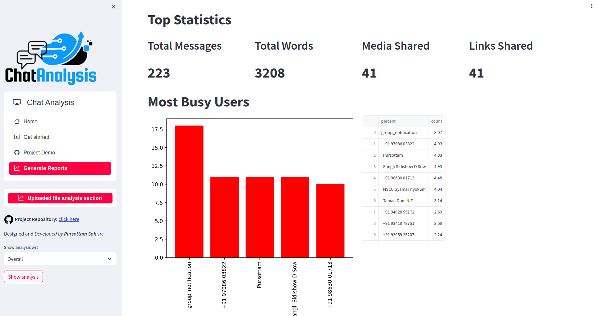
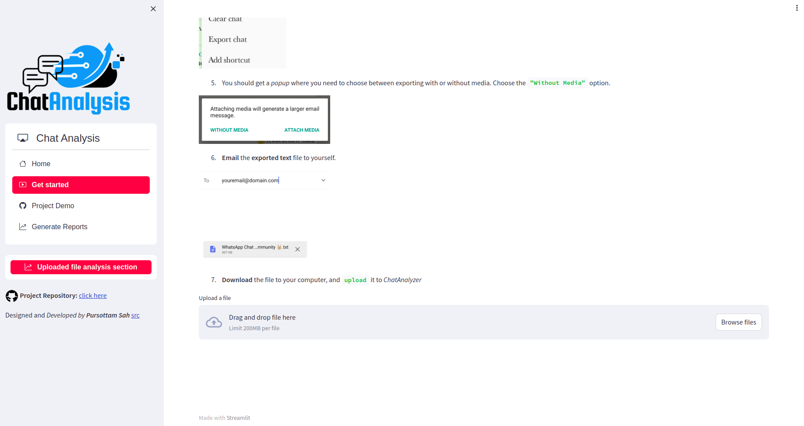
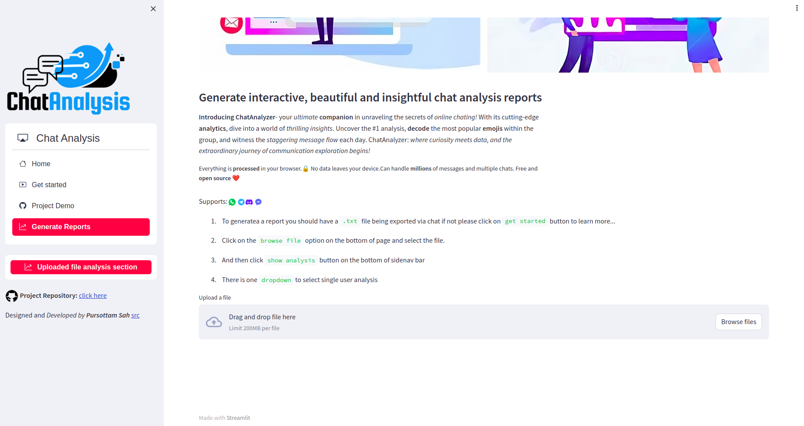
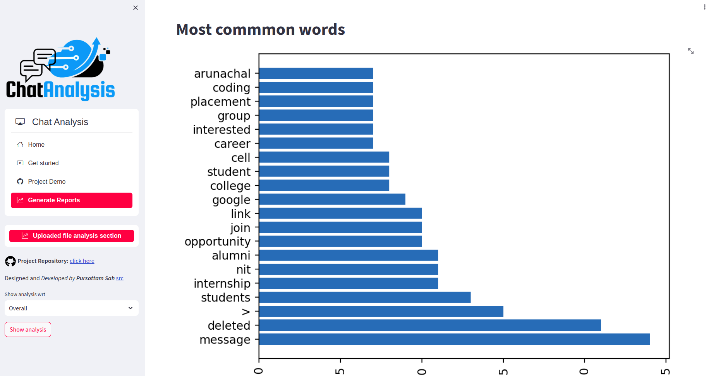
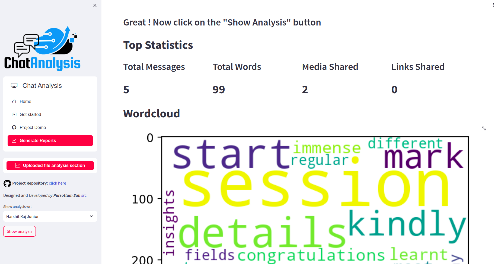
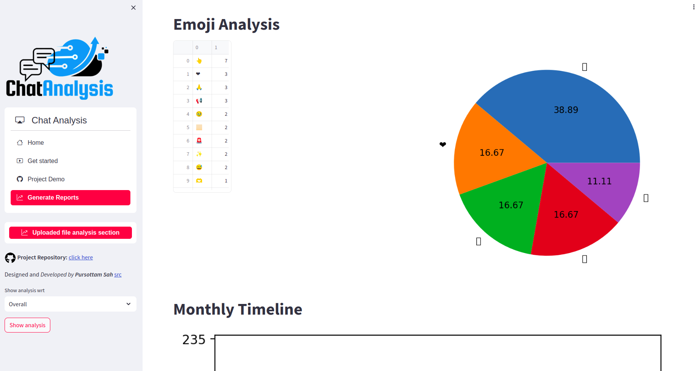
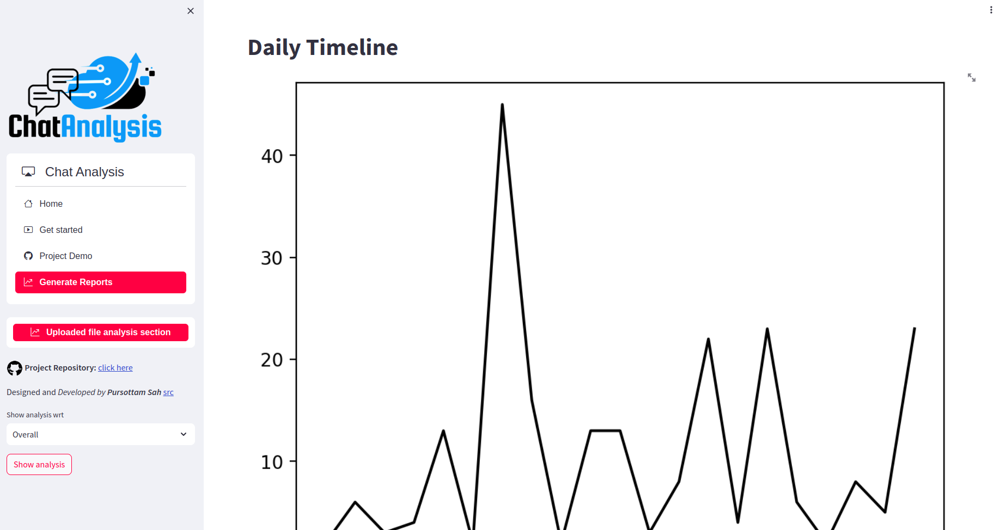
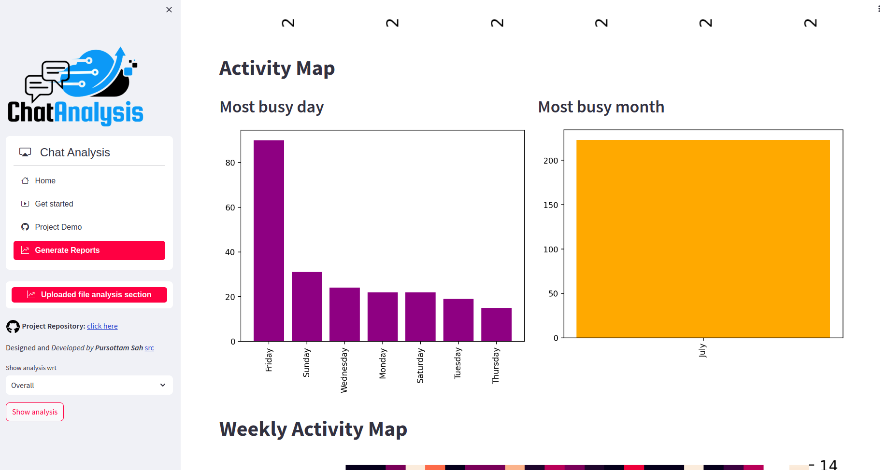
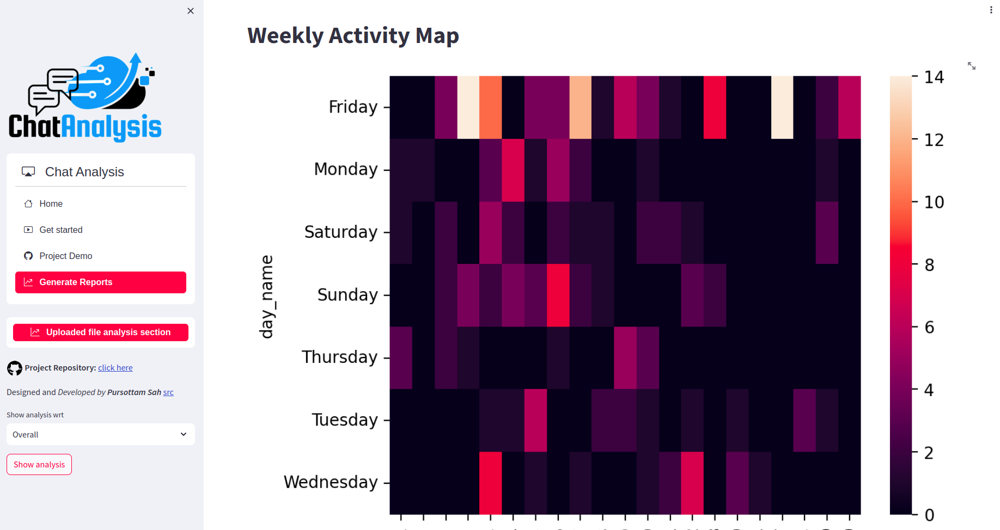

<h1 align="center" id="title"> 

🚀 [Chat Analyzer](https://chat-analyzer-mdjk.onrender.com/)
</h1>

<p align="center"></p>

<p id="description">Generate interactive, beautiful and insightful chat analysis reports. Everything is processed in your browser.🔒 No data leaves your device.Can handle millions of messages and multiple chats. Free and open source ❤️</p>

<h2>🚀 Demo</h2>

Live website here : [https://chat_analyzer.com](https://chat-analyzer-mdjk.onrender.com/)

Video Link : https://www.youtube.com/embed/2bW4ZDqFVWc

<iframe width="560" height="315" src="https://www.youtube.com/embed/2bW4ZDqFVWc" title="YouTube video player" frameborder="0" allow="accelerometer; autoplay; clipboard-write; encrypted-media; gyroscope; picture-in-picture; web-share" allowfullscreen></iframe>
       

<h2>Some insights of ChatAnalyzer </h2>



  
<br>
<details>

<summary>Project Screenshorts:(click on ▶️ to expand) </summary> 

<br>
<br>
<h3>The landing page:</h3>


<h3>Get Started Section </h3>




<h3>Generate Reports </h3>



<br>
<br>
<details>
<summary>Show more  (click on ▶️ to expand)  </summary>

<br>

<h3>Analysis</h3>

<br>

<h3>Wordcloud </h3>

<br>

<h3>Most common words </h3>

<br>
<h3> Single person chat analysis </h3>



<h3>Emoji analysis </h3>


<br>
<h3>Daily timeline </h3>

<br>
<h3>Most busy day and month </h3>


<br>
<h3>Heatmap of chats</h3>


<br>
</details>
</details>


<h2>🧐 Features</h2>

Here're some of the project's best features:

*   Reduces time and energy of people who dont know what going on in chats
*   Helps in getting proper sentiments analysis of thier clients
*   Get feedbacks machanisms for chats and activity
*   Proper analysis of users activity 
*   No data leaves your device.
*   Can handle millions of messages and multiple chats.
*   Free and open source 

<h2>🛠️ Installation Steps:</h2>

<p>1. Clone the respository</p>

```
git clone "https://github.com/Pursottam6003/chat_analyzer"
```

<p>2. Install node dependencies</p>

```
pip install -r requirements.txt
```

<p>3. create a new branch</p>

```
git branch -m  newBranchName
```

<p>4. Switch to new branch</p>

```
git switch newBranchName
```

<p>5. Start the server</p>

```
   streamlit run app.py 
```

<h2>🍰 Contribution Guidelines:</h2>

Please fork the repository first and feel free to create genuine issues and pull requests.

  
  
<h2>💻 Built with</h2>

Technologies used in the project:

*   Python
*   Streamlit
*   Bootstrap
*   CSS 
*   Data Analysis

<h2>🛡️ License:</h2>

This project is licensed under the MIT License

<h2>💖Like my work?</h2>

For any technical issues mail us at rahulsah6003@gmail.com